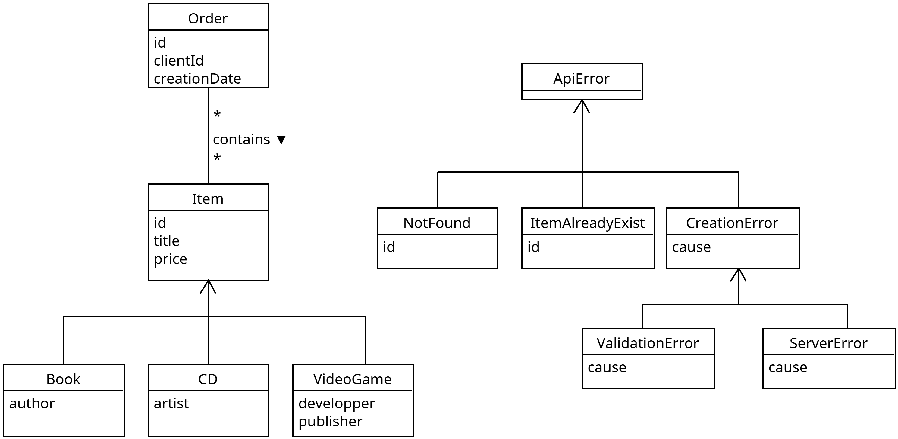

# Tapir Demo Project - Media Store API

This project demonstrates the use of Tapir, a Scala library for describing HTTP endpoints, to create a simple media store API. 

## Data Model



## Stack

- **Tapir**: Used for defining the API endpoints and generating documentation.
- **Http4s**: Used as the HTTP server to handle incoming requests and route them to the appropriate logic.
- **Sttp Client**: Used in the client application to make HTTP requests to the backend API.
- **Circe**: Used for JSON serialization and deserialization of request and response bodies.
- **Swagger UI**: Automatically generated API documentation based on the Tapir endpoint definitions.

## Architecture

The project is structured into three main modules:
- [**Shared**](shared/): Contains the data models and endpoint definitions.
- [**Backend**](backend/): Implements the API logic and integrates with the HTTP server.
- [**Client**](client/): Provides a simple interface for interacting with the API. It actually only demonstrates a few endpoints to show how to use the client code for Tapir.
- **"Database"**: There are no real database in this project, but the backend module includes a simple in-memory repository to store items and orders.

## Prerequisites

- Scala 3.8 or later
- SBT (Scala Build Tool)

## How to Run

1. Launch the backend server:

    ```bash
    sbt backend/run
    ```

2. In a separate terminal, run the client application:

   ```bash
    sbt client/run
    ```

3. To acces the API documentation, open your web browser and navigate to: `http://localhost:8080/docs`

## Available Endpoints

- `GET /items`: Retrieve a list of all items in the media store.
- `GET /items/{id}`: Retrieve a specific item by its unique identifier.
- `POST /items/book`: Create a new book item in the catalog.
- `POST /items/cd`: Create a new CD item in the catalog.
- `POST /items/videogame`: Create a new video game item in the catalog.
- `GET /orders`: Retrieve a list of all orders.
- `GET /orders/{id}`: Retrieve a specific order by its unique identifier.
- `POST /orders`: Create a new order.

## Request Examples

You can run these requests either in you favorite API testing tool or using the Swagger UI available at `http://localhost:8080/docs`.

### Create a New Book Item

Send a POST request to `http://localhost:8080/items/book` with the following JSON body:

```json
{
	"id": "b3",
	"title": "L'Odyssée",
	"price": 22.9,
	"author": [
		"Homère"
	]
}
```

### Create a New Order

Send a POST request to `http://localhost:8080/orders` with the following JSON body:

```json
["b1", "b2", "vg1"]
```

The answer will be a JSON object containing the order details:

```json
{
	"id": "57f0439d-e72a-4919-accd-40017e7a52f1",
	"items": [
		{
			"Book": {
				"id": "b1",
				"title": "Le Seigneur des Anneaux",
				"price": 31.9,
				"author": [
					"Tolkien"
				]
			}
		},
		{
			"Book": {
				"id": "b2",
				"title": "L'étranger",
				"price": 19.9,
				"author": [
					"Camus"
				]
			}
		},
		{
			"VideoGame": {
				"id": "vg1",
				"title": "Zelda BOTW",
				"price": 69.9,
				"developper": "Nintendo EAD",
				"publisher": "Nintendo"
			}
		}
	],
	"totalPrice": 121.7
}
```